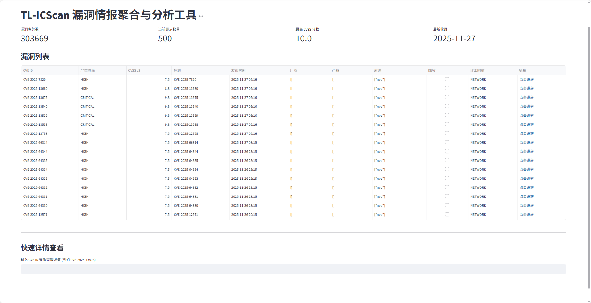

# TL-ICScan 漏洞情报聚合与分析工具

> 本仓库为 TL-ICScan 的代码与采集脚本集合。
>
> **TL-ICScan 由天禄实验室开发。**

[English Version](README_EN.md) ← 中文为主体

## 项目简介

TL-ICScan 是由**天禄实验室**开发的一款面向安全研究人员、红队与蓝队的**本地化漏洞情报聚合与分析工具**。

**一句话原理解析：**
> **Python 负责“进货”，Rust 负责“管库”。**
> 
> *   **Python (采集端)**：像勤劳的采购员，去 NVD、GitHub、Exploit-DB 等网站抓取最新的漏洞情报，并把它们“翻译”成统一格式。
> *   **Rust (核心库)**：像高效的仓库管理员，负责把 Python 抓回来的海量数据快速存入本地数据库，并提供毫秒级的查询服务。
> *   **Web UI (展示端)**：直接读取本地数据库，为您提供无需联网、随查随有的可视化查询体验。

在日常的安全运营与研究中，我们面临着情报源分散（NVD, CISA, 厂商公告, Exploit-DB）、数据格式不统一、以及过度依赖在线查询等痛点。TL-ICScan 旨在解决这些问题：

- **多源聚合**：自动采集并标准化 NVD、CISA KEV、MSRC、Exploit-DB、GitHub PoC 等多方情报。
- **本地私有**：所有数据存储于本地 SQLite 数据库，查询无需联网，保障操作隐蔽性。
- **智能关联**：自动关联漏洞的 PoC 状态、EPSS 评分与厂商公告，提供上帝视角。
- **纯粹情报**：专注于“情报”本身，不绑定资产管理，轻量级且易于集成。
- **全平台支持**：原生支持 Windows、Linux 与 macOS，提供统一的 CLI 操作体验。



---

## 核心功能

1.  **多源采集 (Collectors)**: 模块化 Python 脚本，支持 NVD, CISA KEV, MSRC, Exploit-DB, EPSS, GitHub PoC 等。
2.  **数据标准化**: 将异构数据清洗为统一的 `NormalizedCVE` 格式 (JSONL)。
3.  **高性能存储**: Rust 核心引擎处理数据入库与索引，支持百万级记录秒级查询。
4.  **智能简报 (Digest)**: 基于 YAML 配置关注列表 (Watchlist)，自动生成 Markdown 格式的每日/每周漏洞简报。
5.  **灵活导出**: 支持导出为 JSON/CSV 格式，便于导入 Excel 或其他分析工具。

---

## 快速开始

### 1. 环境准备

- **Rust**: 用于编译核心工具 (`cargo build --release`)
- **Python 3.8+**: 用于运行采集脚本

### 2. 安装

```bash
# 1. 编译核心工具
cd tianlu-intel-core
cargo build --release
# 编译产物位于 target/release/tianlu-intel-core (Windows 为 .exe)

# 2. 安装依赖
# 在项目根目录下运行
pip install -r requirements.txt
```

### 3. 初始化与更新数据

我们提供了一键更新脚本，会自动运行所有采集器并将数据导入数据库 (`tianlu_intel_v2.db`)。

- **Windows**: 运行 `update_all.bat`
- **Linux/macOS**: 运行 `./update_all.sh`

### 4. 常用命令

所有操作通过 CLI 工具完成（假设位于项目根目录）：

**启动 Web UI (可视化仪表盘)**
```bash
# 启动 Web 界面，默认访问 http://localhost:8501
streamlit run web_ui/dashboard.py
```

**查询漏洞列表**
```bash
# 查询最近 7 天发布的的高危漏洞
./tianlu-intel-core/target/release/tianlu-intel-core list --since 7d --severity HIGH --db tianlu_intel_v2.db
```

**查看漏洞详情**
```bash
# 查看特定 CVE 的详细情报（包含描述、CVSS、PoC、参考链接等）
./tianlu-intel-core/target/release/tianlu-intel-core show CVE-2024-12345 --db tianlu_intel_v2.db
```

**生成情报简报**
```bash
# 根据 watchlist.yml 生成简报
./tianlu-intel-core/target/release/tianlu-intel-core digest --config watchlist.yml --since 1d --db tianlu_intel_v2.db
```

---

## 配置说明 (Watchlist)

通过修改 `watchlist.yml` 定制您关注的情报：

```yaml
- name: "Windows 核心组件"
  vendors: ["microsoft"]
  products: ["windows_server_2019", "windows_10"]
  severity_min: "HIGH"

- name: "VPN 设备"
  keywords: ["vpn", "firewall", "pulse_secure"]
  epss_min: 0.1 # 仅关注利用概率 > 10% 的漏洞
```

---

## 贡献与安全

- 贡献代码请参考 [CONTRIBUTING.md](CONTRIBUTING.md)
- 报告安全问题请参考 [SECURITY.md](SECURITY.md)

## 许可证

[MIT License](LICENSE)
